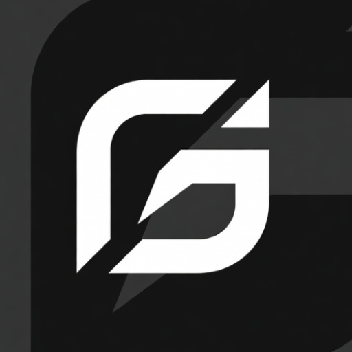

# ⚽ GoalBoard - The Scoreboard

[](https://opensource.org/licenses/MIT)
[](https://reactjs.org/)
[](https://vitejs.dev/)

**Professional digital scoreboard for football, soccer, and sports broadcasts.** Perfect for stadiums, gyms, live streaming, and sports facilities.

👨‍💻 **Developer:** [Jevta (Luka Stoiljkovic)](https://jevta.site)

🌐 **Live Demo:** [goalboard.site](https://goalboard.site)



## ✨ Features

### 🎯 Core Functionality
- **Live Score Tracking** - Real-time score updates with celebration animations
- **Precision Timer** - Match timer with minutes, seconds, and milliseconds
- **Team Management** - Customizable team names
- **Game Statistics** - Yellow cards, red cards, fouls, and corner kicks
- **Period Control** - First Half, Second Half, Extra Time

### 🖥️ Display & Control
- **Projector Mode** - Full-screen mode optimized for stadium displays
- **Keyboard Shortcuts** - Lightning-fast control with comprehensive shortcuts
- **Touch Controls** - Mobile-friendly interface for tablets and phones
- **Zoom Controls** - Adjustable display size (50%-150%)
- **Responsive Design** - Works on desktop, tablet, and mobile

### 🌍 Accessibility
- **Multi-Language** - English and Serbian (Srpski)
- **Device Detection** - Automatic optimization for different devices
- **Orientation Support** - Portrait and landscape modes

### 🎨 Visual Effects
- **Goal Animations** - Celebration effects when goals are scored
- **Team Colors** - Distinct colors for each team (#00FF87 and #FF2D55)
- **Professional Theme** - Dark navy background with electric mint accents

## 🚀 Quick Start

```bash
# Clone the repository
git clone https://github.com/yourusername/goalboard.git

# Navigate to the project
cd goalboard

# Install dependencies
npm install

# Start development server
npm run dev

# Build for production
npm run build
```

## 🎮 Keyboard Shortcuts

### Score Control
- **W** - Increase Team A score
- **Q** - Decrease Team A score
- **P** - Increase Team B score
- **O** - Decrease Team B score

### Timer Control
- **Space** - Start/Pause timer
- **R** - Reset timer (with confirmation)

### Fouls
- **A** - Add foul to Team A
- **S** - Remove foul from Team A
- **L** - Add foul to Team B
- **;** - Remove foul from Team B

### Display
- **F** - Toggle fullscreen
- **Tab** - Toggle Projector Mode
- **N** - Start next match

## 📱 Mobile Controls

On mobile devices, the control panel is hidden and replaced with:
- **Touch Buttons** - Tap +/- to adjust scores
- **Timer Button** - Tap to start/pause the timer
- **Name Editing** - Tap team name to edit
- **Period Selector** - Dropdown to change match period
- **Language Selector** - Fixed top-right corner

## 🛠️ Technology Stack

- **React 18** - UI library
- **Vite** - Build tool and dev server
- **Tailwind CSS** - Styling framework
- **Lucide React** - Icon library
- **Context API** - State management
- **LocalStorage** - Data persistence

## 📦 Project Structure

```
GoalBoard/
├── src/
│   ├── App.jsx                  # Main app component
│   ├── MatchContext.jsx         # Match state management
│   ├── AnimationContext.jsx     # Animation state
│   ├── TranslationContext.jsx   # i18n support
│   ├── ScoreboardDisplay.jsx    # Main scoreboard
│   ├── TeamSection.jsx          # Team display
│   ├── CenterDisplay.jsx        # Timer and VS display
│   ├── ControlPanel.jsx         # Desktop controls
│   ├── MatchControls.jsx        # Timer controls
│   ├── TeamControls.jsx         # Team stats controls
│   ├── LanguageSelector.jsx     # Language dropdown
│   ├── translations.js          # Language strings
│   └── useDeviceDetection.jsx   # Device detection hook
├── public/
│   ├── favicon/                 # All favicon files
│   ├── robots.txt              # Search engine rules
│   ├── sitemap.xml             # Site structure
│   ├── llms.txt                # AI crawler info
│   └── humans.txt              # Credits
└── index.html                   # Entry point with SEO
```

## 🎨 Color Palette

```css
--broadcastNavy: #0A1628     /* Background */
--electricMint: #00FF87      /* Team A / Accents */
--broadcastRed: #FF2D55      /* Team B / Delete */
--steelBlue: #2C3E50         /* UI Elements */
--slateGray: #7F8C8D         /* Secondary Text */
--goalGreen: #10B981         /* Success Actions */
```

## 🌐 SEO Optimization

GoalBoard is optimized for search engines with:
- Comprehensive meta tags
- Open Graph tags for social sharing
- Twitter Card tags
- Structured data (JSON-LD Schema.org)
- Semantic HTML5
- robots.txt and sitemap.xml
- llms.txt for AI crawlers

### Target Keywords
football scoreboard, soccer scoreboard, game scoreboard, sports scoreboard, live scoreboard, digital scoreboard, stadium scoreboard, broadcast scoreboard, score tracker, game timer, match scoreboard, electronic scoreboard, scoreboard software, scoreboard app

## 🎯 Use Cases

- **Stadiums & Arenas** - Display live scores on large screens
- **Live Broadcasting** - Professional overlay for sports streams
- **Gymnasiums** - Track scores for indoor sports
- **Training Sessions** - Time drills and exercises
- **Amateur Leagues** - Professional scoreboard for community sports
- **Multi-Sport Events** - Versatile for various competitions

## 📄 License

MIT License - feel free to use this project for personal or commercial purposes.

## 🤝 Contributing

Contributions are welcome! Please feel free to submit a Pull Request.

## 📧 Contact

For questions or support, please open an issue on GitHub.

---

Made with ⚽ by [Jevta (Luka Stoiljkovic)](https://jevta.site)
